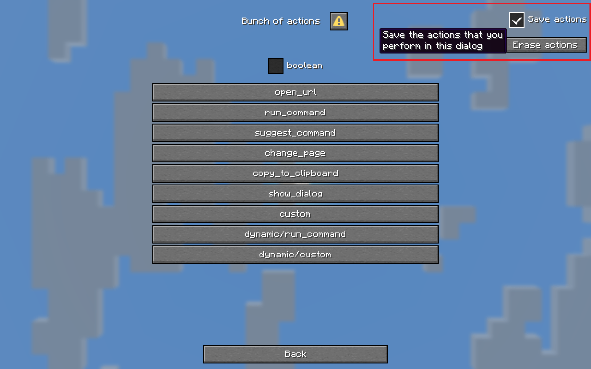
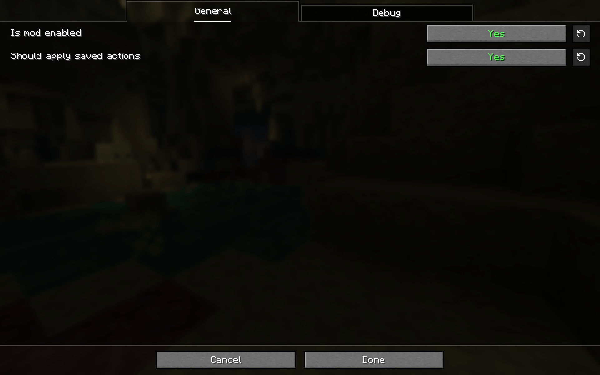

This is a Minecraft Fabric mod that automatically performs the dialog actions that you saved before. This mod is useful for example when a server needs you to click a dialog action when joining it - you can let the mod click the action for you!

## Installation

- [Fabric API](https://modrinth.com/mod/fabric-api) (required);
- [Fabric Language Kotlin](https://modrinth.com/mod/fabric-language-kotlin) (required);
- [Mod Menu](https://modrinth.com/mod/modmenu) (or some other mod to change the mod's config) (very much recommended).

## Usage

### Saving actions

To use the mod, first wait for the dialog that you need the mod to remember to show up. Then check the "Save actions" checkbox and start performing the actions that you need the dialog to replay later, such as pressing buttons or closing the dialog.

If a saved dialog action is not present in the dialog (because the dialog got updated), it will not be performed by the mod, so you'll have to save actions again. 

Actions are saved in Minecraft's `.dialogclicker` directory, and you can safely delete them.

### Erasing actions

If you made a mistake you can press the "Erase actions" button to erase the performed and saved actions.

⚠️ If you've saved a closing action in a dialog, and you want to erase it, you won't be able to simply press the "Erase actions" button because the dialog immediately gets closed by the mod. To resolve this you can disable the "Should apply saved actions" option in the mod config, erase the saved actions and re-enable the config option.

### Configuration

The entire mod is configured through the Mod Menu UI with helpful tooltips. Below is a short description of every option currently there:

### Should apply saved actions

Toggle if saved actions are performed by the mod. Enabled by default.

### Logging options

Control which messages should be logged:

- All messages, including errors (don't recommend turning off);
- Action saving;
- Action loading;
- Received dialog SNBT, disabled by default;
- Received dialog JSON, disabled by default.

## I have a problem/suggestion/translation

[Please open an issue on GitHub](https://github.com/Bamberghh/dialogclicker/issues/new).
